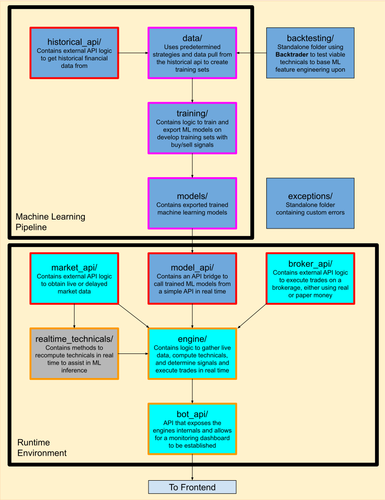

# Mid-Frequency Trading Bot

A machine learning based mid-frquency trading bot for equities, with real time signal generation.

## Motivation

The goal of this project is to automate trading in real time by using an trained Machine Learning (ML) model at runtime to predict in real-time buy and sell signals. 

## Goals

- Complete Machine Learning Pipeline
- Real-time trading engine
- User Defined Trading Logic
- Monitoring Dashboard
- Modular structure
- Hot-swapping ML models at runtime

## Tech Stack

This project uses `Go` and `Python` to split the runtime engine and ML training repsonsibilities
- Python was used to train ML models due to its extensive library ecosystem
- Go was used as the runtime engine due to its low latency

### Ok but why Go?
We could use `Python` or even `C++` as the runtime engine, but:
- `Python` is intreperted and has GIL overhead
- `C++` has higher complexity than `Go`, especially for multithreading and API calls

`Go` is a well balanced choice between enjoying low-level performance while allowing fast iteration. 

Likewise because this is a Mid-Freq Trading System there is an concern of overehead, but not to the extend of High-Freq Trading Systems which is why even with a Garbage Collector Overhead, `Go` is still an acceptable choice.

<!-- ## Architecture

The following diagram highlights the modular back end architecture.

### Legend

#### Box Colors
- Golang (Cyan)
- Python (Blue)
- C (Gray)

#### Box Borders 
- ML Pipeline (Pink)
- APIs (Red)
- Runtime logic (Orange)

-->
    
## Future Additions
- General 
  - More built-in technical indicators at training and run time
- Machine Learning Pipeline
  - Additions to train on multiple stocks
  - Allow users to tune hyperparameters
  - Allow uesrs to choose ML model (KNN, Linear Regression, etc.)
- APIs
  - Find a higher frequency market data streamer
  - Convert ML API to use `FastAPI` instead of `Flask`

## Limitations

There are several limitaions with this trading bot, however the most signficant are listed below. 
- Ingestion of delayed data, up to 1-15 minutes
- Burn-in period during live execution (~30 minutes)

## Requirements

In order to make and view trades you will need an Alpaca API account. The API keys will need to be stored in a `.env` file in the top level directory. You will also need to register for a finnhub account to stream real time data as well to your those associated keys as well. These should also be stored in the `.env` file. 

Required packages are listed in the requirements.txt, those can be stored in a venv directory by calling `python -m venv venv` from the top level directory and then installed by calling `pip install -r requirememts.txt`. There is a provided script to activate the virtual environment by calling `source env.sh`.

## Notes

To see a current list of the WIP efforts check the `TODO.md`, and to see the version histories of this repo chceck the `CHANGELOG.md`.
