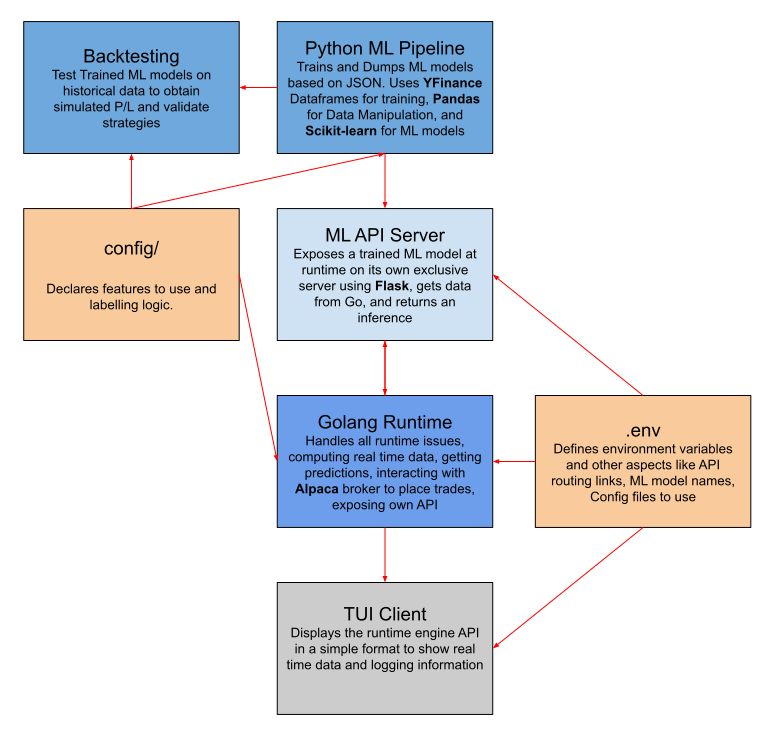

    

# StratForge 

StratForge is a platform for building and running custom trading bots, where users define strategies through configuration, no code edits required. It handles the entire ML pipeline, backtesting, and live trading infrastructure, making it easy to prototype and deploy new ideas quickly.

Note: This project is actively under improvement. Here is a list of current and upcoming features. 

## Completed Features

### Config Driven Architecture (JSON)
- Choose a strategy from supported technical indicators (EMA, Delta, etc.) 
- Declare labelling logic as the relationships between technical indicators
- Every service uses the same config, eliminating feature misalignment 
### Full ML Pipeline (Python)
- Scikit-learn Random Forest Classifier Model 
- Multi-asset training (configurable)
- Dynamically adjusts features, labels, and training tickers based on config files
### Backtesting Module (Python)
- Quickly test trained ML models on historical data to analyze P/L
### Live Execution w/ Broker Integration (Go)
- Runtime engine
  - Polls Market Data
  - Manages declared config value features
  - Communicates via HTTP REST with a ML API Server for real time inference
  - Places trades (paper or real) using individual Alpaca account
  - Exposes own API for live monitoring
  - Error handling from bad configs, failed API calls, etc
  - Supports trading intervals from minutes to seconds

## In Progress
### ML Pipeline
  - Conversion to `XGBoost` models exclusively 
  - Hyperparameter tuning via config files
  - Configurable label rebalancing for training
### Backtesting Module
  - Graphical representation of buy/sell history using `matplotlib`
### Live Execution 
- Reduce ML inference latency by using gRPC
- Reduce market data polling latency by using websockets
-  Multi asset trading configurable by JSON
### UI
- CLI
  - Python based CLI for quick jobs (training, backtesting)
- TUI Client
  - Using `textual`
  - Planned live dashboard monitoring logging, account, and data information 
  - Easier interface to modify `.env` or `JSON` configs
### Other 
- Support for more technical indicators / features
  - Current
    - EMA
    - SMA
    - Deltas (and Difference of Deltas)
  - Future
    - RSI
    - MACD
    - Bollinger Bands

Project size is around 2000 LOC divided between ~60 files. 

## Architecture
Philosophy
- Config Driven 
  - Prevent feature misalignment by ensuring every service uses the same config setup
  - Think of the config like a contract that every other service must agree to
- Decoupled Systems
  - All services are separated and independent
  - At Runtime
    - The ML Model runs on its own server
    - The Go runtime computes features and receives inferences via HTTP REST calls

This design allows for independent parts to be scaled and improved without affecting other systems

## Tech Stack
| Feature | Language | Technologies | APIs |
|:-------:|----------|--------------|------|
| ML Training Pipeline | Python | Pandas, NumPy, Scikit-learn | YFinance |
| Backtesting Module | Python | Pandas, NumPy, Scikit-learn | YFinance |
| Runtime Engine | Go, Python | Flask | Alpaca |
| CLI Tool | Python | N/A | N/A |
| TUI | Python | Textual | Runtime Engine API |

### Why Use Go?
To support both low (minutes) and mid (seconds) frequency trading strategies `Go` provided a fair trade between speed and complexity
- `Python` GIL overhead and interpreted, not ideal for concurrency
- `C++` is too complex (for this project), complicating currency, API calls, and other things for slightly better performance

Go is fast enough to support both types of strategies while allowing for faster iteration of code with simple concurrency and low latency

    
## Setup

To use this program you will need to follow these steps
- Clone this repository
- Set up the market data and broker API
  - [Register](https://app.alpaca.markets/account/login) for an Alpaca Account (Free)
  - Once signed in there will be both API keys and an API secret 
  - At the root is a [`.env.example`](.env.example) file, put the API key and secret in their proper places, and rename the file to `.env`
  - If you wish to test only, make sure you are using **paper money**
- Create the virtual environment for `Python` (Python3)
  - If on the bash shell run these commands
    - `python3 -m venv venv` (Creates the virtual environment folder)
    - `pip install -r requirements.txt` (Install Python dependencies)
    - `source ./scripts/env.sh` (Shorthand to start the virtual environment)
- Configuration
  - The JSON files are configurable, more info [here](config/README.md)
  - Make sure that if you wish to use a different configuration file, change the respective values in [`.env`](.env.example)
  - There are other settings available in the [`.env`](.env.example) file that impact things from refresh rates to api links. 

<!-- 
- Docker Container
  - Docker files are contained in docker/, as well as a `docker-compos,e`
  - 
- Build the docker image  
-->

## Limitations
- Ingestion of delayed data 
  - `Alpaca` free tier market API uses delayed data by default
  - Can be overcome with a higher tier `Alpaca` account
- Forced burn-in Period
  - During live execution we need to burn-in data 
  - `Alpaca` does not provide after hours market data 
  - To prevent major jumps from market close to market open, burn in is forced (or override for debug purposes)
- 60 second floor for live execution cycle rate
  - `Alpaca` market API + `YFinance` API induced limitation
  - `Alpaca` data only updates every minute, so polling market data within the same minute dilutes feature values
  - `YFinance` only has historical data down to a minute, so ML models cannot be trained on faster intervals
  - Therefore unless you can provide a higher tier `Alpaca` account AND higher frequency trained model, keep the `cycle_rate` in the JSON config `>=60`

## Testing

All `Python` based tests are contained in `./tests/` and all `Go` based tests are located in `./src/runtime/go-src/tests`.

To run tests: `python3 stratforge_cli.py test`

## Documentation 
- [CONFIG](docs/CONFIG.md) - Learn the StratForge custom JSON schema
- [ENV](docs/ENV.md) - Environment settings details
- [CLI](docs/CLI.md) - How to use the StratForge CLI

## Notes
- [CHANGELOG](docs/CHANGELOG.md) - Version history details
- [TODO](docs/TODO.md) - Other long-term improvements
- [LICENSE](LICENSE) - License info 

*This platform is intended for research and development purposes only, please use paper trading or simulated funds to prevent real financial losses.*