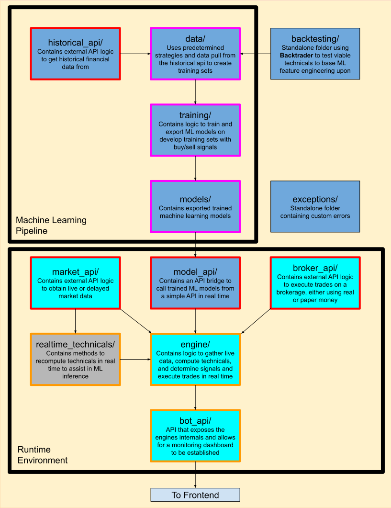

     

# Modular ML Sandbox for Low/Mid-Frequency Trading

**Don't be fooled by the repo name, this started as a trading bot, but it turned into something more** 

Now this project aims to be a fully modular, configurable ML sandbox designed for low- to mid-frequency traders.

It enables users to train, backtest, and run custom trading strategies from a single, extensible platform. A configuration-first approach powered by JSON files and plug-and-play architecture makes it easy to experiment with a wide variety of strategies without ever having to change any underlying core logic. Whether you’re testing signals, tuning models, or switching indicators, the platform is built to help you find what works.

## Why its different
- Vast Configuration 
	- `JSONs` as the single source of truth for ML training AND runtime
	- Settings to get your own strategy down (see `.env.example`!)
- Easy Adaptability
	- Need a new technical indicator? Adding a new one doesn't require an entirely new codebase!
	- Need to test a ML model that updates every second instead of every hour? This platform allows you do seamlessly switch from low to mid frequency testing
- Live execution 
	- Run your own models at runtime. Just sign up for an `Alpaca` account, its free!
	- You could even use real money (don't recommend)
- Other cool features
	- Monitoring Dashboard -- bootstrapped using `Next` the runtime engine exposes its own API to expose real-time data and a log of its actions
- Future Additions
	- Custom ML backtesting engine -- perfect for testing your strategy on historical data
	- Model selection -- chose your own model provided by `scikit-learn` to fit your needs
	- Multiple stock tracking and training -- ability to train and trade on multiple stocks 
	- More technical indicators - adding them is simple, doing the math for them is hard

## Tech Stack
The majority of this project was written using `Go` for live execution and `Python` for anything ML. There is also a `Next` based dashboard that monitors and logs the runtime engine in real time. 

### Why Use Go?
You might be wondering why `Go` was used for this project and not `Python` or `C++` as the runtime engine. 

Well, since this project is intended to used for both low and mid frequency trading:
- `Python` is interpreted and has GIL overhead
- `C++` is too complex (for this project), and complicates API calls and multithreading

`Go` served as a fair trade off between performance and complexity, allowing for fast iteration while still providing low latency code. 

<!-- ## Architecture

The following diagram highlights the modular back end architecture.

### Legend

#### Box Colors
- Golang (Cyan)
- Python (Blue)
- C (Gray)

#### Box Borders 
- ML Pipeline (Pink)
- APIs (Red)
- Runtime logic (Orange)

-->
    
## Future Additions
- General 
  - More built-in technical indicators at training and run time
- Machine Learning Pipeline
  - Additions to train on multiple stocks
  - Allow users to tune hyperparameters
  - Allow uesrs to choose ML model (KNN, Linear Regression, etc.)
  - Find a higher frequency historical data provider
- APIs
  - Find a higher frequency market data streamer
  - Convert ML API to use `FastAPI` instead of `Flask`
- Runtime
  - Be able to train and track multiple stocks at once

## How to Run

To use this program you will need to follow these steps
- Clone this repository
- Set up the market data and broker API
  - [Register](https://app.alpaca.markets/account/login) for an Alpaca Account (Free)
  - Once signed in there will be both API keys and an API secret 
  - At the root is a [`.env.example`](.env.example) file, put the API key and secret in their proper places, and rename the file to `.env`
  - If you wish to test only, make sure you are using **paper money**
- Create the virtual environment for `Python` (Python3)
  - If on the bash shell run these commands
    - `python3 -m venv venv` (Creates the virtual environment folder)
    - `pip install -r requirements.txt` (Install Python dependencies)
    - `source ./scripts/env.sh` (Shorthand to start the virtual environment)
- Configuration
  - The JSON files are configurable, more info [here](config/README.md)
  - Make sure that if you wish to use a different configuration file, change the respective values in [`.env`](.env.example)
  - There are other settings available in the [`.env`](.env.example) file that impact things from refresh rates to api links. 

<!-- 
- Docker Container
  - Docker files are contained in docker/, as well as a `docker-compos,e`
  - 
- Build the docker image  
-->

## Limitations
The most significant limitations of this platform are
- Ingestion of delayed data
  - More of an `Alpaca` issue since the free tier for market data is delayed by default
- Burn-in period during live execution 
  - This is caused by a current lack of market data available after hours, so using the same technical indicator values from market close at market open could lead to large jumps
  - Pair this with an ML model, it could lead to unwanted predictions or trades, so as of now burn-in is required at live execution to initialize technical indicator values for the sake of ML inference
  - This again is another issue with `Alpaca` free tier since data only updates once every minute, unless you have access to higher frequency data
  - But also caused by the `YFinance` API, used for ML training, only goes down to bars of 1 minute for historical stock data
  - Therefore it is a good idea not to go below `60` seconds for the refresh rate for the runtime engine unless 
    - You have another pickled ML model that was trained on higher frequency data
    - You have access to a higher tier `Alpaca` account 
  - It's important to note that the runtime engine can handle refresh rates to every second
    - But if you lack the requirements above
      - Technical data becomes diluted from the same stock price being used
      - Which in turn degrades ML inference
      - Or your ML model was not trained on such high frequencies
      - Causing poor performance
      - So be careful!

## Notes
- [CHANGELOG](docs/CHANGELOG.md)
- [TODO](docs/TODO.md)
- [LICENSE](LICENSE)
