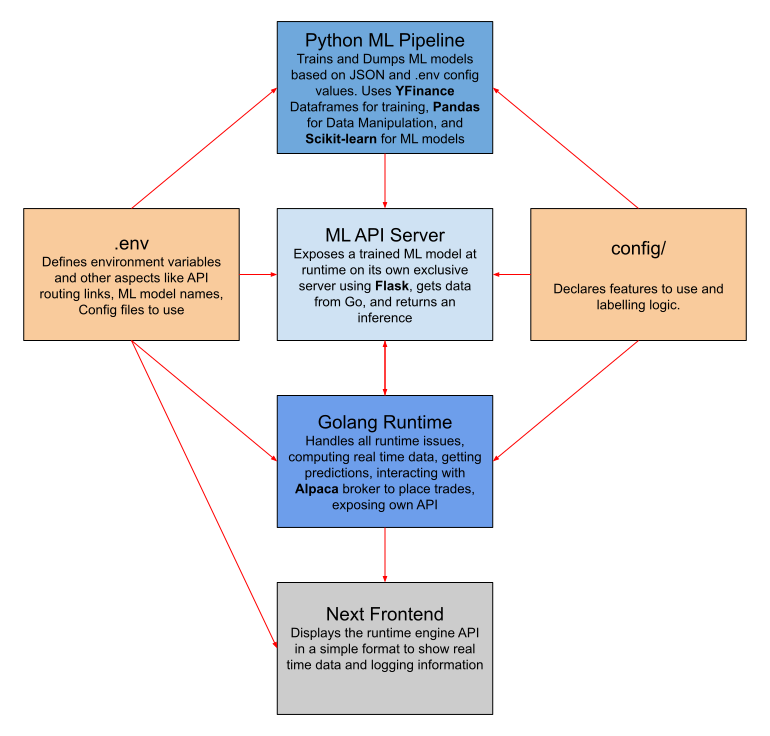

     

# BotBuilder – Infra-Heavy ML Based Trading Bot Suite

An infra-heavy configurable ML Suite to train, backtest, and run in real time custom Low/Mid Frequency Trading Bots via simple `JSON` configurations.  

Thanks to a modular approach, configurable `JSON` files allow easily change features and labelling logic for training ML models, and allows the user to quickly expereiment with a wide variety of technical indicators without ever having to touch any of the underlying code. Whether you are looking to run a trained model live, find the best strategy, or trying to maximize returns, this suite allows you to search for what works. 

## Core Features
- Config-First Architecture
  - All behavior is driven by `JSON` and `.env` configs from strategy, refresh rates, features, models, and more, it's all user-defined. No hardcoded assumptions. 
- Modular ML Pipeline
  - Train <!-- and retrain --> models effortlessly by just modifying config files. Built for experimentation and iteration.
- Custom Backtesting Engine (Coming Soon)
  - Test strategies across historical data with your own logic, quickly know if your strategy and model holds up.
- Live Execution Engine
  - Just plug in your Alpaca API keys and go live. Real-time trading support with the ability to run your trained model in production (paper or real).
  - Plug in your Alpaca API keys and go live with trading using your trained model
- Risk Management System (Planned)
  - Automatic risk management and portfolio rebalancing to add guardrails to your trained model during live execution

## Tech Stack
- `Go`
  - Used for the runtime engine during live execution 
- `Python`
  - Used for ML Pipeline
    - `Pandas`
    - `NumPy`
    - `Scikit-learn`
- `Typescript`
  - Used for demo frontend
    - `Next`

### Why Use Go?
You might be wondering why `Go` was used for this project and not `Python` or `C++` as the runtime engine. 

Well, since this project is intended to be used for both low and mid frequency trading:
- `Python` is interpreted and has GIL overhead
- `C++` is too complex (for this project), and complicates API calls and multithreading among other things

`Go` served as a fair trade off between performance and complexity, allowing for fast iteration while still providing low latency code. 

## Architecture
The simplest way to describe this architecture is config first 

You simply define your own JSON based features and labels (technical indicators) and the environment variables in .env, the platform takes into account at training and runtime what you wanted making it far easier to test. 

The following diagram highlights what is happening in the background. 

### Why this design?
- ML and runtime are completely seperated but unified under a single `JSON`
  - Think of the `JSON` config as a contract between the ML pipeline and the runtime engine where they agree upon using the same features so there is no confusion about what needs to be computed
- Decoupled by language
  - Anything ML is done in `Python`, and anything runtime is done in `Go`
  - This makes developing each indiviual component easier and less prone to conflict
- ML API server
  - This provides the bridge between `Go` and the ML model
  - This allows for real time inference as `Go` gives the data, and `Go` gets back a prediction
    
## Future Additions
- General 
  - More built-in technical indicators at training and run time
- Machine Learning Pipeline
  - Additions to train on multiple stocks
  - Allow users to tune hyperparameters
  - Allow uesrs to choose ML model (KNN, Linear Regression, etc.)
  - Find a higher frequency historical data provider
- APIs
  - Find a higher frequency market data streamer
  - Convert ML API to use `FastAPI` instead of `Flask`
- Runtime
  - Be able to train and track multiple stocks at once

## Setup

To use this program you will need to follow these steps
- Clone this repository
- Set up the market data and broker API
  - [Register](https://app.alpaca.markets/account/login) for an Alpaca Account (Free)
  - Once signed in there will be both API keys and an API secret 
  - At the root is a [`.env.example`](.env.example) file, put the API key and secret in their proper places, and rename the file to `.env`
  - If you wish to test only, make sure you are using **paper money**
- Create the virtual environment for `Python` (Python3)
  - If on the bash shell run these commands
    - `python3 -m venv venv` (Creates the virtual environment folder)
    - `pip install -r requirements.txt` (Install Python dependencies)
    - `source ./scripts/env.sh` (Shorthand to start the virtual environment)
- Configuration
  - The JSON files are configurable, more info [here](config/README.md)
  - Make sure that if you wish to use a different configuration file, change the respective values in [`.env`](.env.example)
  - There are other settings available in the [`.env`](.env.example) file that impact things from refresh rates to api links. 

<!-- 
- Docker Container
  - Docker files are contained in docker/, as well as a `docker-compos,e`
  - 
- Build the docker image  
-->

## Limitations
The most significant limitations of this platform are
- Ingestion of delayed data
  - More of an `Alpaca` issue since the free tier for market data is delayed by default
- Burn-in period during live execution 
  - This is caused by a current lack of market data available after hours, so using the same technical indicator values from market close at market open could lead to large jumps
  - Pair this with an ML model, it could lead to unwanted predictions or trades, so as of now burn-in is required at live execution to initialize technical indicator values for the sake of ML inference
- Lack of support for higher frequency trading (`<60` seconds refresh rates)
  - This again is another issue with `Alpaca` free tier since data only updates once every minute, unless you have access to higher frequency data
  - But also caused by the `YFinance` API, used for ML training, only goes down to bars of 1 minute for historical stock data
  - Therefore it is a good idea not to go below `60` seconds for the refresh rate for the runtime engine unless 
    - You have another pickled ML model that was trained on higher frequency data
    - You have access to a higher tier `Alpaca` account 
  - It's important to note that the runtime engine can handle refresh rates to every second
    - But if you lack the requirements above
      - Technical data becomes diluted from the same stock price being used
      - Which in turn degrades ML inference
      - Or your ML model was not trained on such high frequencies
      - Causing poor performance
      - So be careful!

## Testing

All `Python` based tests are contained in `./tests/` and all `Go` based tests are located in `./src/runtime/go-src/tests`. 

You can call `./scripts/tests/` from the root to run both `Python` and `Go` tests.

## Documentation 
- [ENV](docs/ENV.md) - Understand how the `.env` file is used
- [CONFIG](docs/CONFIG.md) - Learn how to construct your own strategies using our custom JSON schema

## Notes
- [CHANGELOG](docs/CHANGELOG.md) - Version history 
- [TODO](docs/TODO.md) - List of current efforts and future 
updates
- [LICENSE](LICENSE) - License info 

*This platform is intended for research and development purposes only, please use paper trading or simulated funds to prevent real financial losses.*