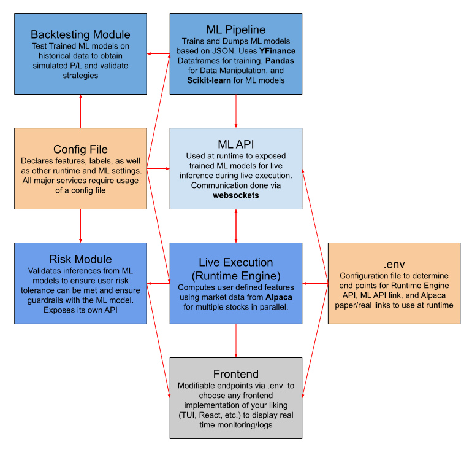

  
# ConTrade

*ConTrade -- Configurable Trading*

ConTrade is a platform allowing users to easily define low/mid frequency trading strategies in a single config file and easily use integrated services to train, backtest, and execute models live using the `Alpaca` broker.  

No more headaches trying to test a new strategy or experiment, simply change a `JSON` file and retrain, retest, or redeploy live. 

For more detailed information about ConTrade, visit the [docs](https://vkatari10.github.io/trading-bot/)

**Note**: This project is actively under improvement. Below is a list of current and upcoming features. 

## Features

> Every feature uses the same config file, eliminating feature misalignment, and keeping every service on the same page!

### Config Driven Architecture (JSON)
- Choose your own strategy from supported technical indicators (SMA, EMA, Delta, etc.) 
- These technical indicators serve as features to train ML models to your specifications
- Define your own labelling logic as well to outline buy/sell signals
### ML Pipeline (Python)
- Scikit-learn Random Forest Classifier Model 
- Support for configurable multi-asset training
### Backtesting (Python)
- Quickly test trained ML models on historical stock data to analyze P/L via CLI
### Live Execution w/ Broker Integration (Go/Python)
- Run trained models live
- Alpaca Brokerage Integration (paper or real money)
- Exposes own API with configurable endpoints for monitoring
- Multi-Asset Trading 
- Supports intervals from minutes to seconds 
- Error documentation [here](docs/ERRORS.md)
### UI (Python)
- CLI Tool to easily call services for any config files
  - Training
  - Backtesting
  - Live Execution 
  - Tests
  - See docs [here](docs/CLI.md)
### Tests (Go, Python)
 - Unit Tests for both Go (`go test`) and Python (`pytest`) source

Project size is ~3500 total lines (source, comments, structure) across ~50 files.

## Architecture
Philosophy
- Config Driven 
  - Every service uses the **same** config file -- no confusion anywhere about what needs to be computed
  - Think of the config file as a contract, both the ML Pipeline and Live Execution will agree on what features need to be used
- Decoupled Systems
  - All languages and most systems are decoupled as much as possible 
    - the ML Pipeline (written in Python) and Live Execution services (written in Go) share **no** code
    - the ML Pipeline and Backtesting services (both written in Python) do share some code (DataFrame Construction)
  - Python and Go **only** communicate via websockets for live ML inference 

This design allows for independent parts to be scaled and improved without affecting other systems

## Tech Stack 
| Feature | Language | Libraries/Frameworks | External APIs |
|:-------:|----------|--------------|------|
| Config Files | JSON | - | - | 
| ML Training Pipeline | Python | Pandas, NumPy, Scikit-learn, TA-Lib | YFinance |
| Backtesting | Python | Pandas, NumPy, Scikit-learn | YFinance |
| Runtime Engine | Go, Python | FastAPI, Gorilla WebSocket, TA-Lib | Alpaca |
| Risk Engine (WIP) | Go | - | Alpaca |
| CLI | Python | Rich | - |
| TUI (WIP) | Python | Rich | Runtime Engine API |
| Tests | Go, Python | Pytest | - | 
| DevOps (WIP) | YAML | Docker, GitHub Actions | - |

### Why Use Go?
To support both low (minutes) and mid (seconds) frequency trading strategies `Go` provided a fair trade between speed and complexity
- `Python` GIL overhead and interpreted, not ideal for concurrency
- `Java` is harder to iterate with compared to `Go`'s module system and single compiled binary
- `C++` is too complex (for this project), complicating currency, API calls, and other things for slightly better performance

Go is fast enough to support both types of strategies while allowing for faster iteration of code with simple concurrency and low latency

## Setup

To use this program you will need to follow these steps
- Clone this repository
- Set up the market data and broker API
  - [Register](https://app.alpaca.markets/account/login) for an Alpaca Account (Free)
  - Once signed in there will be both API keys and an API secret 
  - At the root is a [`.env.example`](.env.example) file, put the API key and secret in their proper places, and rename the file to `.env`
  - If you wish to test only, make sure you are using **paper money**
- Download `TA-Lib` dependencies
  - This project depends on the `TA-Lib` library 
  - Instructions [here](https://ta-lib.org/install/) and [here](https://github.com/TA-Lib/ta-lib-python?tab=readme-ov-file)
- Create the virtual environment for `Python` (Python3)
  - If on the bash shell run these commands
    - `python3 -m venv venv` (Creates the virtual environment folder)
    - `pip install -r requirements.txt` (Install Python dependencies)
    - `source venv/bin/activate` (Shorthand to start the virtual environment)
- Configuration
  - The JSON files are configurable, more info [here](config/README.md)
  - Make sure that if you wish to use a different configuration file, change the respective values in [`.env`](.env.example)
  - There are other settings available in the [`.env`](.env.example) file that impact things from refresh rates to api links. 

<!-- 
- Docker Container
  - Docker files are contained in docker/, as well as a `docker-compos,e`
  - 
- Build the docker image  
-->

## Limitations
- Ingestion of delayed data 
  - `Alpaca` free tier market API uses delayed data by default
  - Can be overcome with a higher tier `Alpaca` account
- Forced burn-in Period
  - During live execution we need to burn-in data 
  - `Alpaca` does not provide after hours market data 
  - To prevent major jumps from market close to market open, burn in is forced (or override for debug purposes)
- 60 second floor for live execution cycle rate
  - `Alpaca` market API + `YFinance` API induced limitation
  - `Alpaca` data only updates every minute, so polling market data within the same minute dilutes feature values
  - `YFinance` only has historical data down to a minute, so ML models cannot be trained on faster intervals
  - Therefore unless you can provide a higher tier `Alpaca` account AND higher frequency trained model, keep the `cycle_rate` in the JSON config `>=60`

## Documentation 
- [CONFIG](docs/CONFIG.md) - Learn the ConTrade custom JSON schema
- [ENV](docs/ENV.md) - Environment settings details
- [CLI](docs/CLI.md) - How to use the ConTrade CLI

## Notes
- [CHANGELOG](docs/CHANGELOG.md) - Version history details
- [TODO](docs/TODO.md) - Other long-term improvements
- [LICENSE](LICENSE) - License info 

**Disclaimer**: *This project is provided for educational and research purposes only. It is **not** financial advice. Use it at your own risk.* *The author is **not** responsible for any financial losses or damages resulting from the use of this software, including but not limited to trading with real money.*